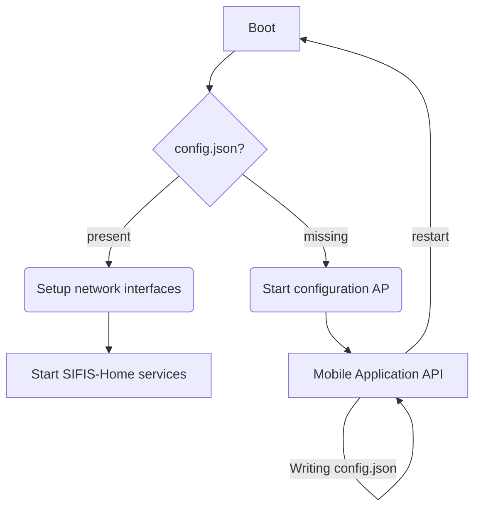

# Mobile Application API

The Mobile Application API allows the Mobile application to initialize new devices to the SIFIS-Home network. In addition, the following functionality has been planned:

* Reporting device status
    * CPU usage
    * Memory usage
    * Disk space usage
* Sending commands
    * Factory reset settings
    * Restart device
    * Shut down device

## Smart Device Initialization


The Mobile Application API will run on Smart Device, and the Mobile Application connects to it using Wi-Fi. An authorization key is needed to use the API, and it is planned to be delivered with Smart Device in a QR code form. The mobile application can scan a QR code with the camera to receive the authorization key.

The mobile application retrieves device information using the authorization key. The information contains the device name and unique MAC address. Then, the mobile application presents the information to the user and helps the user choose the correct device if several devices are available.

The mobile application defines the device's configuration, represented in the following subsection. After the configuration has been sent, the mobile application asks the device to restart. After the restart, the new Smart Device becomes part of the SIFIS-home network.

### Device Configuration

The configuration file is stored on the device in the `/opt/sifis-home/config.json` file. The presence of this file allows Smart Device to join the SIFIS-Home network. Without the file, the device starts in the initialization mode, where it creates Wi-Fi access point for the mobile application.

All SIFIS-Home services running on the device can read this file, but only the Mobile Application API is allowed to write it. Other SIFIS-Home services are not started on the device if the file is missing.

The configuration file contains:

* Device name (user defined)
* Shared key for DHT

Configuration file mockup:

```json
{
    "dht-shared-key": "32 bytes in hex format",
    "name": "User-defined name for the device"
}}
```


### Network Configuration

The Mobile Application API also stores network configuration defined by the user in the system's network configuration files. These settings can be cleared with the factory reset function.

* Connection type
     * Wired
     * Wireless
         * Access point SSID
         * Security (WEP/WPA/WPA2)
* Address
     * From DHCP
     * Static

In the mobile application, static network settings could be behind the advanced settings button, and the device uses DHCP by default.

## Devide Information File

The idea behind this file is that it is written at the factory. The file contains the unique data of the device and the authorization key. We create this file ourselves for demonstrations or let the Mobile Application API make it.

The file is stored on the device in the `/opt/sifis-home/device.json` and contains the following information.

* Product name
* Unique identifier
* Authorization key
* Private key location (*sifis-dht generates on the first run*)

Some or all of these are delivered with the device in a QR code for the mobile application to scan.

Device info file mockup:

```json
{
    "authorization-key": "256-bits in hex format",
    "private-key-file": "/opt/sifis-home/private.pem",
    "product-name": "Name of the product (not unique)",
    "uuid": "128-bit UUID in standard hex format"
}
```

## Smart Device Boot


