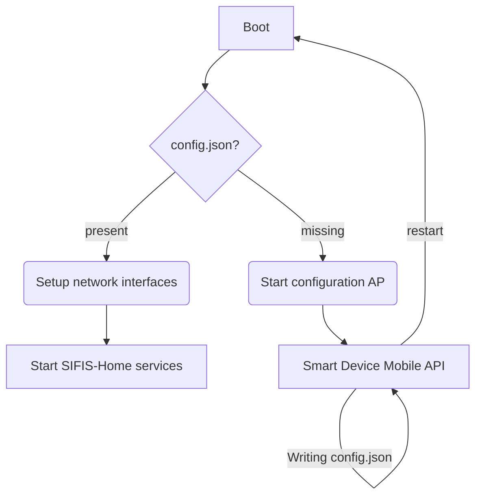

# Smart Device Mobile API

The Smart Device Mobile API allows the Mobile application to initialize new devices to the SIFIS-Home network. In addition, the following functionality has been planned:

* Reporting device status
    * CPU usage
    * Memory usage
    * Disk space usage
    * Uptime
    * Load average
* Sending commands
    * Factory reset settings
    * Restart device
    * Shut down device

## Endpoints

* Device information and configuration

  * [GET] device/status

  * [GET,PUT] device/configuration

* Commands

  * [GET] command/factory_reset
  * [GET] command/restart
  * [GET] command/shutdown

## Smart Device Initialization


The Smart Device Mobile API will run on Smart Device, and the Mobile Application connects to it using Wi-Fi. An authorization key is needed to use the API, and it is planned to be delivered with Smart Device in a QR code form. The mobile application can scan a QR code with the camera to receive the authorization key.

The mobile application retrieves device information using the authorization key. The information contains the device name and unique identifier. Then, the mobile application presents the information to the user and helps the user choose the correct device if several devices are available.

The mobile application defines the device's configuration, represented in the following subsection. After the configuration has been sent, the mobile application asks the device to restart. After the restart, the new Smart Device becomes part of the SIFIS-home network.

### Device Configuration

The configuration file is stored on the device in the `/opt/sifis-home/config.json` file. The presence of this file allows Smart Device to join the SIFIS-Home network. Without the file, the device starts in the initialization mode, where it creates Wi-Fi access point for the mobile application.

All SIFIS-Home services running on the device can read this file, but only the Smart Device Mobile API is allowed to write it. Other SIFIS-Home services are not started on the device if the file is missing.

The configuration file contains:

* Device name (user defined)
* Shared key for DHT

Configuration file mockup:

```json
{
    "dht-shared-key": "32 bytes in hex format",
    "name": "User-defined name for the device"
}
```


### Network Configuration

The Smart Device Mobile API also stores network configuration defined by the user in the system's network configuration files. These settings can be cleared with the factory reset function.

* Connection type
     * Wired
     * Wireless
         * Access point SSID
         * Security (WEP/WPA/WPA2)
* Address
     * From DHCP
     * Static

In the mobile application, static network settings could be behind the advanced settings button, and the device uses DHCP by default.

## Device Information File

The idea behind this file is that it is written at the factory. The file contains the unique data of the device and the authorization key. We create this file ourselves for demonstrations or let the Smart Device Mobile API make it.

The file is stored on the device in the `/opt/sifis-home/device.json` and contains the following information.

* Product name
* Unique identifier
* Authorization key
* Private key location (*sifis-dht generates on the first run*)

Some or all of these are delivered with the device in a QR code for the mobile application to scan.

Device info file mockup:

```json
{
    "authorization-key": "256-bits in hex format",
    "private-key-file": "/opt/sifis-home/private.pem",
    "product-name": "Name of the product (not unique)",
    "uuid": "128-bit UUID in standard hex format"
}
```

## Smart Device Boot



# Demo Setup on Raspberry Pi 4

This part of the document contains research and instructions on installing the Smart Device Mobile API solution on a Raspberry Pi 4 for demo purposes. 

The solution does not require a Raspberry Pi 4 computer. However, Raspberry Pi was chosen because one was already available, and its Wi-Fi chip was known to support the necessary AP operating mode.

Any Linux system should work if the Wi-Fi chip has the required AP operating mode. We can use this document for other Linux setups, but we may need to do slightly different actions.

## SIFIS-Home Targets

The systemd is probably the most common solution for managing services on Linux systems. Below is a simplified graph of default boot targets and services to the multi-user target. The multi-user target has everything running except the graphical user interface and was chosen for the example as SIFIS-Home devices likely do not have displays attached to them.


We can create two new targets for the SIFIS-Home device, the selection of which target is active is based on whether the `config.json` file exists. Now we can set up systemd services to be wanted by one of the targets to decide whether they are run. Services that are only needed for configuration are installed under `sifis-config.target`, and services for the fully configured system are installed under `sifis-home.target`. The image below shows added targets with their conditions.


**Note**: Other targets relevant to boot were left out of the picture to clarify SIFIS-Home target additions. All targets and services left out of the picture still exist. We only add two new targets and do not remove anything.

These targets are added to the `/etc/systemd/system` directory.

___

`sifis-config.target` example:

```ini
# The target for an unconfigured SIFIS-Home system

[Unit]
Description=SIFIS-Home Configuration Mode
Wants=network.target
After=network.target
ConditionPathExists=!/opt/sifis-home/config.json
Conflicts=rescue.service rescue.target shutdown.target

[Install]
WantedBy=multi-user.target
```

___

`sifis-home.target` example:

```ini
# The target for a fully configured SIFIS-Home system

[Unit]
Description=SIFIS-Home System
Wants=network.target
After=network.target
ConditionPathExists=/opt/sifis-home/config.json
Conflicts=rescue.service rescue.target shutdown.target

[Install]
WantedBy=multi-user.target
```

___

We can enable these targets with the following commands:

```bash
$ sudo systemctl enable sifis-config.target
$ sudo systemctl enable sifis-home.target
```

### Binding Services to Targets

We tried several ways to start the services using our created targets. In the end, using the **`BindsTo=`** and **`After=`** in systemd unit files produced expected results. The Systemd unit file documentation says this about these settings:

> `BindsTo=`
>
> Configures requirement dependencies, very similar in style to `Requires=`. However, this dependency type is stronger: in addition to the effect of `Requires=` it declares that if the unit bound to is stopped, this unit will be stopped too. This means a unit bound to another unit that suddenly enters inactive state will be stopped too. Units can suddenly, unexpectedly enter inactive state for different reasons: the main process of a service unit might terminate on its own choice, the backing device of a device unit might be unplugged or the mount point of a mount unit might be unmounted without involvement of the system and service manager.
>
> When used in conjunction with `After=` on the same unit the behaviour of `BindsTo=` is even stronger. In this case, the unit bound to strictly has to be in active state for this unit to also be in active state. This not only means a unit bound to another unit that suddenly enters inactive state, but also one that is bound to another unit that gets skipped due to an unmet condition check (such as `ConditionPathExists=`, `ConditionPathIsSymbolicLink=`, … — see below) will be stopped, should it be running. Hence, in many cases it is best to combine `BindsTo=` with `After=`.
>
> When `BindsTo=b.service` is used on `a.service`, this dependency will show as `BoundBy=a.service` in property listing of `b.service`. `BoundBy=` dependency cannot be specified directly.

> `Before=`, `After=`
>
> These two settings expect a space-separated list of unit names. They may be specified more than once, in which case dependencies for all listed names are created.
>
> Those two settings configure ordering dependencies between units. If unit `foo.service` contains the setting `Before=bar.service` and both units are being started, `bar.service`'s start-up is delayed until `foo.service` has finished starting up. `After=` is the inverse of `Before=`, i.e. while `Before=` ensures that the configured unit is started before the listed unit begins starting up, `After=` ensures the opposite, that the listed unit is fully started up before the configured unit is started.
>
> When two units with an ordering dependency between them are shut down, the inverse of the start-up order is applied. I.e. if a unit is configured with `After=` on another unit, the former is stopped before the latter if both are shut down. Given two units with any ordering dependency between them, if one unit is shut down and the other is started up, the shutdown is ordered before the start-up. It doesn't matter if the ordering dependency is `After=` or `Before=`, in this case. It also doesn't matter which of the two is shut down, as long as one is shut down and the other is started up; the shutdown is ordered before the start-up in all cases. If two units have no ordering dependencies between them, they are shut down or started up simultaneously, and no ordering takes place. It depends on the unit type when precisely a unit has finished starting up. Most importantly, for service units start-up is considered completed for the purpose of `Before=`/`After=` when all its configured start-up commands have been invoked and they either failed or reported start-up success. Note that this does includes `ExecStartPost=` (or `ExecStopPost=` for the shutdown case).
>
> Note that those settings are independent of and orthogonal to the requirement dependencies as configured by `Requires=`, `Wants=`, `Requisite=`, or `BindsTo=`. It is a common pattern to include a unit name in both the `After=` and `Wants=` options, in which case the unit listed will be started before the unit that is configured with these options.
>
> Note that `Before=` dependencies on device units have no effect and are not supported. Devices generally become available as a result of an external hotplug event, and systemd creates the corresponding device unit without delay.


## Software Access Point

Now that we have suitable SIFIS-Home targets, we want to start a Wi-Fi access point with the `sifis-config.target`. First, however, we must ensure that our Wi-Fi device can create an AP before we continue.

### Checking for AP Operating Mode

We need a Wi-Fi device that supports AP operating mode. We can use `iw list` command to check this. The *Supported interface modes* block should include **AP**:

```bash
$ sudo iw list
Wiphy phy0
...
        Supported interface modes:
                 * IBSS
                 * managed
                 * AP	<- This must be found
                 * P2P-client
                 * P2P-GO
                 * P2P-device
...
```

### Hostapd

The hostapd is a user space daemon for access point and authentication servers.

#### Install

```bash
$ sudo apt install hostapd
```

#### Configure

##### Start with config target

We need create a override file for the *hostapd* service  to bind it run with the *sifis-config* target. The recommended way is to use *systemctl edit* command for this:

```bash
$ sudo systemctl edit hostapd.service
```

```ini
### Editing /etc/systemd/system/hostapd.service.d/override.conf
### Anything between here and the comment below will become the new contents of the file

[Unit]
After=sifis-config.target
BindsTo=sifis-config.target

### Lines below this comment will be discarded

### /etc/systemd/system/hostapd.service
# [Unit]
# Description=Access point and authentication server for Wi-Fi and Ethernet
# Documentation=man:hostapd(8)
# After=network.target
#
# [Service]
# Type=forking
# PIDFile=/run/hostapd.pid
# Restart=on-failure
# RestartSec=2
# Environment=DAEMON_CONF=/etc/hostapd/hostapd.conf
# EnvironmentFile=-/etc/default/hostapd
# ExecStart=/usr/sbin/hostapd -B -P /run/hostapd.pid -B $DAEMON_OPTS ${DAEMON_CONF}
#
# [Install]
# WantedBy=multi-user.target
```

Now we can enable the service, and it should work as expected.

```bash
$ sudo systemctl daemon-reload
$ sudo systemctl enable hostapd.service
```

Try to reboot the device without the `config.json` file, and the service should start, and then reboot with the `config.json` file present, and the service should not start.

