# Demo Raspberry Pi Setup

We have tried to collect all the necessary steps into this document that can be used to repeat the demo installation made in the SIFIS-Home project. The goal of the demo installation was to try the Mobile API service and start the device in different modes depending on whether it is configured via Mobile API or not.

When the device is not configured, it starts with Wi-Fi access point to allow the Mobile application to connect the API for configuration. Wi-FI access point is not started after the configuration is done and the device has been restarted.

## The Device

Demo setup was done on Raspberry Pi 4 Model B 4GB RAM with 1.5GHz 64-bit Quad-core CPU. Operating system was installed on Sandisk 64GB Ultra, microSDXC, UHS-I U1 / A1. 

## Preparing the SD card

We used the Raspberry Pi Imager to create the SD card. It is available from: https://github.com/raspberrypi/rpi-imager

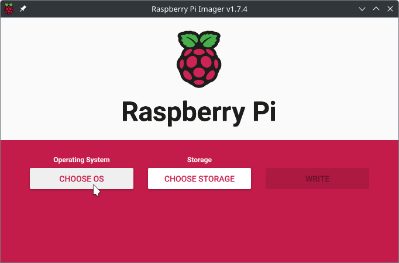

We start by choosing the Operating System we would like to use. 

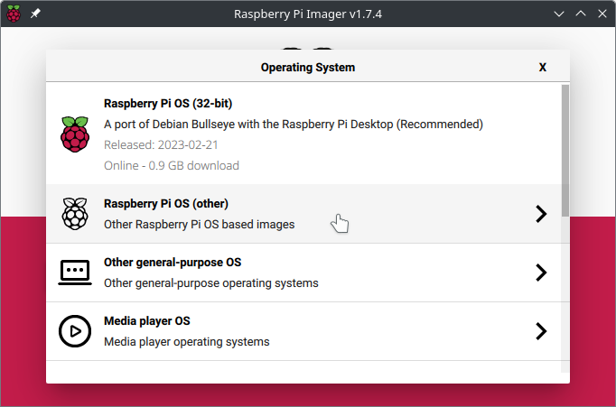

We selected the Raspberry Pi OS (Other) for more options.

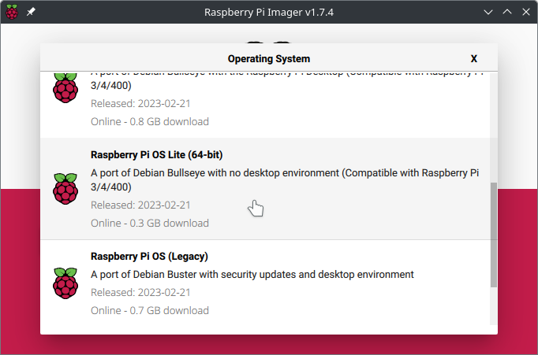

Scrolling down the list, we can find the Raspberry Pi OS Lite (64-bit). This was chosen as we liked the idea of using a 64-bit operating system, and since we planned to do a setup without a monitor, the Lite version without a desktop environment was a good choice.

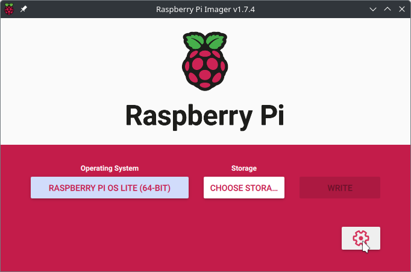

Since we installed OS without a monitor, getting an SSH connection to the machine was necessary. Fortunately, it is possible to define this by selecting the gear icon.

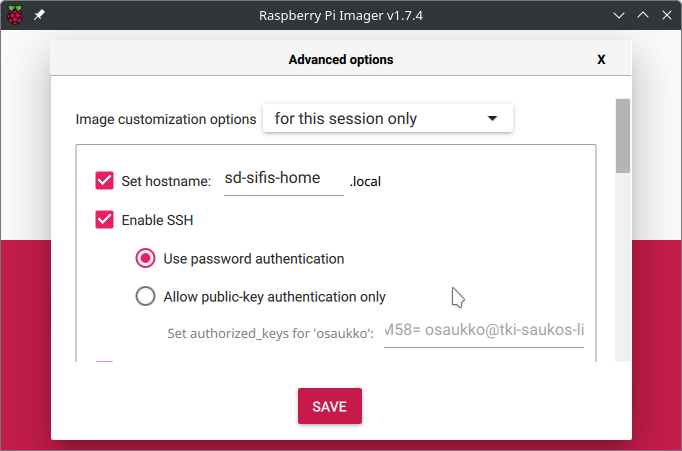

We set the hostname to `sd-sifis-home` and, as mentioned above, turned on SSH using password authentication.

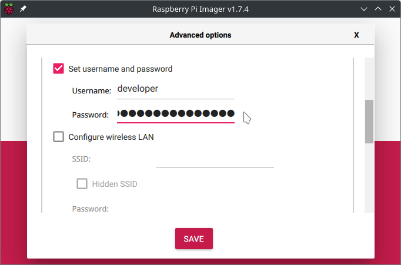

We defined a `developer` user with a password for allowing the SSH login.

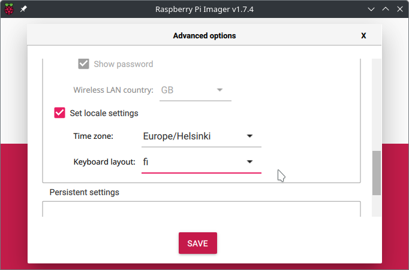

We also defined the local settings at the same time.

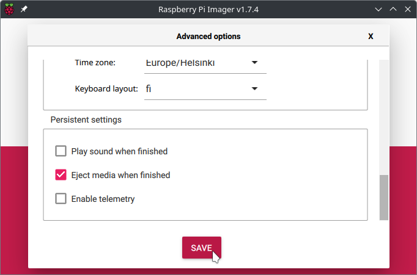

Finally, we chose SAVE.

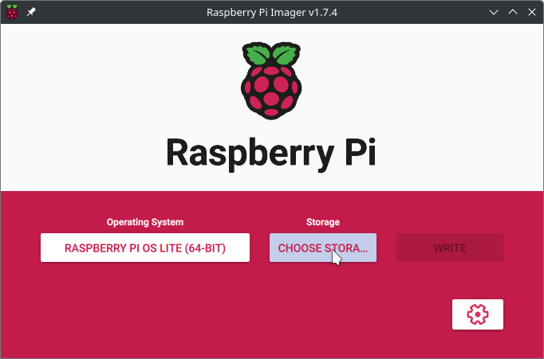

Next, we had to choose which storage device to write the system.

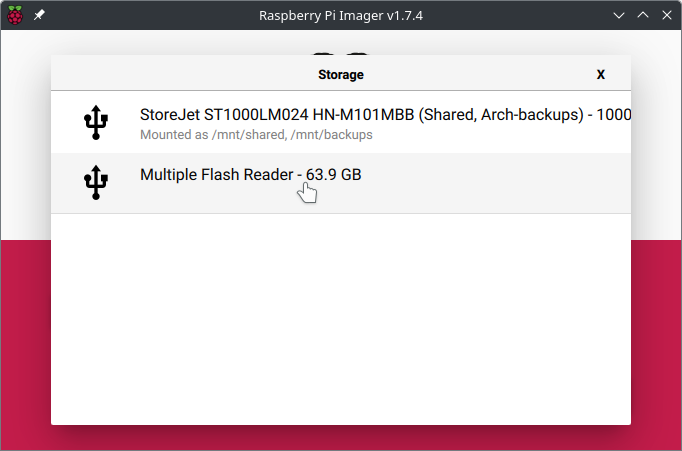

This was the choice for us, but if you are repeating this, then this is probably a little different for you. Be careful not to write the system to the wrong device accidentally.

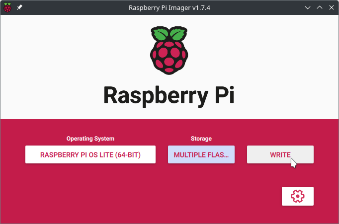

When everything is ready, finally select WRITE.

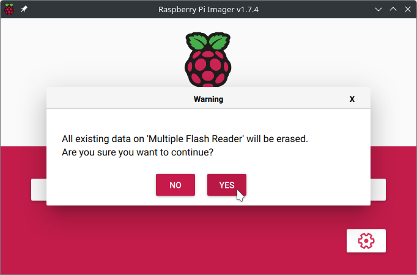

And let's accept the writing by selecting YES

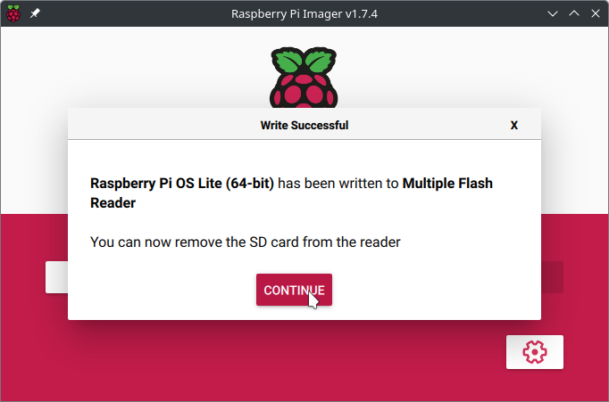

The SD card is now ready and can be inserted into the Raspberry Pi computer. Next, let's continue over the SSH connection.

## Installing Updates

We continued the installation by connecting the Raspberry Pi to the network, where we could check from the DHCP server which IP address it gives for the device. We then established an SSH connection to the device using the IP address.


``` bash
username@other-computer:~ $ ssh developer@192.168.5.158
developer@sd-sifis-home:~ $ sudo apt update&&sudo apt upgrade&&sudo autoremove
```

## Installing WireGuard

**Please note:** This step was made because of security policies and is not required for the demonstration. However, we describe this step just in case it is affecting the results. You probably can skip over this.

Since the device is supposed to be placed in a network, which is isolated for security reasons. Even the developers do not have access to the isolated network. Luckily the device has Internet access from the isolated network, which allows us to create a VPN connection to access the device behind firewalls.

```bash
sudo apt install wireguard
sudo nano /etc/wireguard/wg0.conf
sudo systemctl start wg-quick@wg0
sudo systemctl enable wg-quick@wg0
sudo reboot
```

We then checked that we could connect device using the VPN connection. As a final step, we set static IP addresses that were assigned for the demo device.

## Installing Firewall

We installed the UFW for simplicity. However, it is crucial to be extra careful when installing over SSH.

```bash
sudo apt install ufw
sudo ufw default deny
sudo ufw allow ssh comment SSH

# This step was needed for the WireGuard mentioned in the previous section
sudo ufw allow in on eth0 proto udp from any to any port 24073 comment WireGuard

# We install tmux to have a shell session that stays even if we get disconnected
sudo apt install tmux
tmux

# Now we carefully try to enable the firewall and disable it automatically after 60 seconds
sudo ufw enable;sleep 60;sudo ufw disable
```

We try to establish another SSH connection to the device after the last comment. If we can do it before 60 seconds timeout, then the firewall setup is good so far. Otherwise, we need to check the UFW setup and try again.

When the setup is okay, we enable it permanently:

```bash
sudo ufw enable
```

## Installing Smart Device Mobile API

On the host machine, we cloned the https://github.com/sifis-home/wp6_mobile_application_api repository and built the Debian package for the Raspberry PI (arm64) following the readme. We then uploaded the Debian package to the target device and installed it:

```bash
# Done the host machine from the project folder after Debian packge is built
cd target/aarch64-unknown-linux-gnu/debian/

# Uploading package to the sd-sifis-home host (Raspberry Pi 4)
scp sifis-home-mobile-api_0.1.0_arm64.deb sd-sifis-home:/home/developer 

# Connecting to the target device
ssh sd-sifis-home 

# Installing the package
sudo dpkg -i sifis-home-mobile-api_0.1.0_arm64.deb
```

We continued by creating the device setup, enabling and starting the server, and opening firewall port for it.

```bash
# Creating device setup and API key as Qr-code
sudo create_device_info -s /home/developer/api-key-qr.svg "Demo Device"

# We can edit the service to change the port and listening address
sudo systemctl edit --full mobile-api-server.service 
# However, we went with the defaults

# Enabling and starting the server
sudo systemctl start mobile-api-server.service
sudo systemctl enable mobile-api-server.service

# Checking that the server is running
sudo systemctl status mobile-api-server.service

# Opening port in firewall (EDIT TO MATCH YOUR SETUP)
sudo ufw allow in on wg0 proto tcp from any to any port 8000 comment "Allowing Mobile API on WireGuard"
```

Now if everything is okay, we should be access the Smart Device Mobile API developer site:

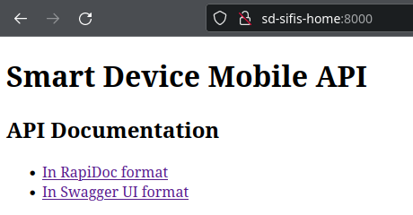

### Testing the API

We can use the API directly from the browser by selecting either RapiDoc or Swagger UI formatted API documentation. However the API key is needed.

On target machine we can write the following command to output device setup, which includes the API key.

```bash
cat /opt/sifis-home/device.json
```

The API key is called as `"authorization_key"` in the configuration file, the value after it is the key we can use to access all features from the Smart Device Mobile API.

### Updating the Scripts

The Smart Device Mobile API provides commands for restarting, shutting down, and factory resetting. Using these commands will run the corresponding script in the folder `/opt/sifis-home/scripts/`.  By default, the scripts do nothing, so let's modify them to actually perform the desired actions.

**Restart script**

```bash
sudo nano /opt/sifis-home/scripts/restart.sh
```

```bash
#!/bin/bash

# Let's ask systemd to do a reboot
systemctl reboot
```

**Shutdown script**

```bash
sudo nano /opt/sifis-home/scripts/shutdown.sh
```

```bash
#!/bin/bash

# Let's ask systemd to do a poweroff
systemctl poweroff
```

**Factory reset script**

```bash
sudo nano /opt/sifis-home/scripts/factory_reset.sh
```

```bash
#!/bin/bash

# We don't have any special actions yet, but maybe they will accumulate later
```

## Adding SIFIS-Home Targets

First, we create a target for unconfigured state with the command `sudo systemctl edit --force --full sifis-config.target`

**sifis-config.target**

```ini
# The target for an unconfigured SIFIS-Home system

[Unit]
Description=SIFIS-Home Configuration Mode
Wants=network-online.target
After=network-online.target
ConditionPathExists=!/opt/sifis-home/config.json
Conflicts=rescue.service rescue.target shutdown.target

[Install]
WantedBy=multi-user.target
```

Next, we create target for fully configured state with the command `sudo systemctl edit --force --full sifis-home.target`

**sifis-home.target**

```ini
# The target for a fully configured SIFIS-Home system

[Unit]
Description=SIFIS-Home System
Wants=network-online.target
After=network-online.target
ConditionPathExists=/opt/sifis-home/config.json
Conflicts=rescue.service rescue.target shutdown.target

[Install]
WantedBy=multi-user.target
```

We enable both targets, but the conditions in the files ensure that the `sifis-home.target` is only active if the device is configured, i.e. `/opt/sifis-home/config.json` file exists, and correspondingly the `sifis-config.target` is active only in the opposite situation.

```bash
# Enabling targets
sudo systemctl enable sifis-config.target
sudo systemctl enable sifis-home.target
```

It is time test it:

```bash
# Restarting the target device
rpi4: sudo reboot

# Establishing a new connection
host: ssh sd-sifis-home

# Checking that config target is active
rpi4: sudo systemctl status sifis-config.target
● sifis-config.target - SIFIS-Home Configuration Mode
     Loaded: loaded (/etc/systemd/system/sifis-config.target; enabled; vendor preset: enabled)
     Active: active since Wed 2023-04-26 10:38:47 EEST; 1min 0s ago

Apr 26 10:38:47 sd-sifis-home systemd[1]: Reached target SIFIS-Home Configuration Mode.

# Checking that home target is not active
rpi4: sudo systemctl status sifis-home.target
● sifis-home.target - SIFIS-Home System
     Loaded: loaded (/etc/systemd/system/sifis-home.target; enabled; vendor preset: enabled)
     Active: inactive (dead)
  Condition: start condition failed at Wed 2023-04-26 10:38:47 EEST; 2min 55s ago
             └─ ConditionPathExists=/opt/sifis-home/config.json was not met

Apr 26 10:38:47 sd-sifis-home systemd[1]: Condition check resulted in SIFIS-Home System being skipped.
```

## Wi-Fi Access Point

We want the device to provide a Wi-Fi access point for the phone when the device is in configuration mode, i.e., `sifis-config.target` is active. 

First of all, we need to turn on Wi-Fi. Let's start with the command:

```bash
sudo raspi-config 
```

Then select from menu:

1. `5 Localisation Options Configure language and regional settings`
2. `L4 WLAN Country Set legal wireless channels for your country`
3. Your country from the list. Tip: Press the first letter of the country name on the keyboard.
4. If you want, check other settings as well.

Now we install hostapd and reboot:

```bash
sudo apt install hostapd
sudo reboot
```

We know that the Raspberry Pi 4's Wi-Fi chip can work in AP mode, but we can use `iw list|less` command to check it. The *Supported interface modes* block should include **AP**:

```bash
$ sudo iw list|less
Wiphy phy0
...
        Supported interface modes:
                 * IBSS
                 * managed
                 * AP	<- This must be found
                 * P2P-client
                 * P2P-GO
                 * P2P-device
...
```

### Configure hostapd

Before hostapd can be used, a configuration file must be created for it. Let's make it from the template and modify it for our use.

```bash
sudo cp /usr/share/doc/hostapd/examples/hostapd.conf /etc/hostapd/
sudo nano /etc/hostapd/hostapd.conf
```

Example configuration is good, we made only some small changes. Ellipsis `...` means several lines that are without changes

```ini
...
##### IEEE 802.11 related configuration #######################################

# SSID to be used in IEEE 802.11 management frames
ssid=sifis-home-config
...
# Country code (ISO/IEC 3166-1). Used to set regulatory domain.
# Set as needed to indicate country in which device is operating.
# This can limit available channels and transmit power.
# These two octets are used as the first two octets of the Country String
# (dot11CountryString)
country_code=FI
# Set this according to your country
...
# Enable IEEE 802.11d. This advertises the country_code and the set of allowed
# channels and transmit power levels based on the regulatory limits. The
# country_code setting must be configured with the correct country for
# IEEE 802.11d functions.
# (default: 0 = disabled)
ieee80211d=1
...
# Operation mode (a = IEEE 802.11a (5 GHz), b = IEEE 802.11b (2.4 GHz),
# g = IEEE 802.11g (2.4 GHz), ad = IEEE 802.11ad (60 GHz); a/g options are used
# with IEEE 802.11n (HT), too, to specify band). For IEEE 802.11ac (VHT), this
# needs to be set to hw_mode=a. When using ACS (see channel parameter), a
# special value "any" can be used to indicate that any support band can be used.
# This special case is currently supported only with drivers with which
# offloaded ACS is used.
# Default: IEEE 802.11b
hw_mode=g
# Raspberry Pi 4 has 2.4 GHz and 5.0 GHz IEEE 802.11ac wireless.
# We use the 802.11g standard here, as in the example configuration. It is already
# quite old standard but works very likely regardless of what phone the user has.
...
# Channel number (IEEE 802.11)
# (default: 0, i.e., not set)
# Please note that some drivers do not use this value from hostapd and the
# channel will need to be configured separately with iwconfig.
#
# If CONFIG_ACS build option is enabled, the channel can be selected
# automatically at run time by setting channel=acs_survey or channel=0, both of
# which will enable the ACS survey based algorithm.
channel=3
# NOTE: Pi’s built in wireless interfaces do not support ACS.
#       Set a good channel for your environment.
...
# IEEE 802.11 specifies two authentication algorithms. hostapd can be
# configured to allow both of these or only one. Open system authentication
# should be used with IEEE 802.1X.
# Bit fields of allowed authentication algorithms:
# bit 0 = Open System Authentication
# bit 1 = Shared Key Authentication (requires WEP)
auth_algs=1
...
# EAPOL-Key index workaround (set bit7) for WinXP Supplicant (needed only if
# only broadcast keys are used)
#eapol_key_index_workaround=0
...
# Use integrated EAP server instead of external RADIUS authentication
# server. This is also needed if hostapd is configured to act as a RADIUS
# authentication server.
#eap_server=0
...
# The own IP address of the access point (used as NAS-IP-Address)
#own_ip_addr=127.0.0.1
...
```

We can now unmask service and modify it to start with the `sifis-config.target`:

```bash
sudo systemctl unmask hostapd.service 
sudo systemctl edit hostapd.service
```

```ini
### Editing /etc/systemd/system/hostapd.service.d/override.conf
### Anything between here and the comment below will become the new contents of the file

[Unit]
After=sifis-config.target
BindsTo=sifis-config.target

### Lines below this comment will be discarded

### /lib/systemd/system/hostapd.service
# [Unit]
# Description=Access point and authentication server for Wi-Fi and Ethernet
# Documentation=man:hostapd(8)
# After=network.target
# 
# [Service]
# Type=forking
# PIDFile=/run/hostapd.pid
# Restart=on-failure
# RestartSec=2
# Environment=DAEMON_CONF=/etc/hostapd/hostapd.conf
# EnvironmentFile=-/etc/default/hostapd
# ExecStart=/usr/sbin/hostapd -B -P /run/hostapd.pid -B $DAEMON_OPTS ${DAEMON_CONF}
# 
# [Install]
# WantedBy=multi-user.target

```

Finally we update systemd configurations and enable the hostapd service.

```bash
sudo systemctl daemon-reload
sudo systemctl enable hostapd.service
```

The next thing to try is to reboot the device after a configuration or factory reset and make sure that the correct targets and hostpad are started or not. Configuration can be done easily with the Smart Device Mobile API developer interface. 

#### Expected results after configuration

```bash
developer@sd-sifis-home:~ $ systemd-analyze plot > boot.svg 
developer@sd-sifis-home:~ $ sudo systemctl status sifis-config.target  
● sifis-config.target - SIFIS-Home Configuration Mode
     Loaded: loaded (/etc/systemd/system/sifis-config.target; enabled; vendor preset: enabled)
     Active: inactive (dead)
  Condition: start condition failed at Fri 2023-04-28 12:39:09 EEST; 34s ago
             └─ ConditionPathExists=!/opt/sifis-home/config.json was not met

Apr 28 12:39:09 sd-sifis-home systemd[1]: Condition check resulted in SIFIS-Home Configuration Mode being skipped.
developer@sd-sifis-home:~ $ sudo systemctl status sifis-home.target  
● sifis-home.target - SIFIS-Home System
     Loaded: loaded (/etc/systemd/system/sifis-home.target; enabled; vendor preset: enabled)
     Active: active since Fri 2023-04-28 12:39:09 EEST; 38s ago

Apr 28 12:39:09 sd-sifis-home systemd[1]: Reached target SIFIS-Home System.
developer@sd-sifis-home:~ $ sudo systemctl status hostapd.service 
● hostapd.service - Access point and authentication server for Wi-Fi and Ethernet
     Loaded: loaded (/lib/systemd/system/hostapd.service; enabled; vendor preset: enabled)
    Drop-In: /etc/systemd/system/hostapd.service.d
             └─override.conf
     Active: inactive (dead)
       Docs: man:hostapd(8)

Apr 28 12:39:09 sd-sifis-home systemd[1]: hostapd.service: Bound to unit sifis-config.target, but unit isn't active.
Apr 28 12:39:09 sd-sifis-home systemd[1]: Dependency failed for Access point and authentication server for Wi-Fi and Ethernet.
Apr 28 12:39:09 sd-sifis-home systemd[1]: hostapd.service: Job hostapd.service/start failed with result 'dependency'.
developer@sd-sifis-home:~ $ 
```

#### Expected results after factory reset

```bash
developer@sd-sifis-home:~ $ sudo systemctl status sifis-config.target  
● sifis-config.target - SIFIS-Home Configuration Mode
     Loaded: loaded (/etc/systemd/system/sifis-config.target; enabled; vendor preset: enabled)
     Active: active since Fri 2023-04-28 12:34:34 EEST; 3min 41s ago

Apr 28 12:34:34 sd-sifis-home systemd[1]: Reached target SIFIS-Home Configuration Mode.
developer@sd-sifis-home:~ $ sudo systemctl status sifis-home.target  
● sifis-home.target - SIFIS-Home System
     Loaded: loaded (/etc/systemd/system/sifis-home.target; enabled; vendor preset: enabled)
     Active: inactive (dead)
  Condition: start condition failed at Fri 2023-04-28 12:34:34 EEST; 3min 46s ago
             └─ ConditionPathExists=/opt/sifis-home/config.json was not met

Apr 28 12:34:34 sd-sifis-home systemd[1]: Condition check resulted in SIFIS-Home System being skipped.
developer@sd-sifis-home:~ $ sudo systemctl status hostapd.service 
● hostapd.service - Access point and authentication server for Wi-Fi and Ethernet
     Loaded: loaded (/lib/systemd/system/hostapd.service; enabled; vendor preset: enabled)
    Drop-In: /etc/systemd/system/hostapd.service.d
             └─override.conf
     Active: active (running) since Fri 2023-04-28 12:34:34 EEST; 3min 51s ago
       Docs: man:hostapd(8)
    Process: 711 ExecStart=/usr/sbin/hostapd -B -P /run/hostapd.pid -B $DAEMON_OPTS ${DAEMON_CONF} (code=exited, status=0/SUCCESS)
   Main PID: 730 (hostapd)
      Tasks: 1 (limit: 3933)
        CPU: 25ms
     CGroup: /system.slice/hostapd.service
             └─730 /usr/sbin/hostapd -B -P /run/hostapd.pid -B /etc/hostapd/hostapd.conf

Apr 28 12:34:34 sd-sifis-home systemd[1]: Starting Access point and authentication server for Wi-Fi and Ethernet...
Apr 28 12:34:34 sd-sifis-home hostapd[711]: Configuration file: /etc/hostapd/hostapd.conf
Apr 28 12:34:34 sd-sifis-home hostapd[711]: wlan0: interface state UNINITIALIZED->COUNTRY_UPDATE
Apr 28 12:34:34 sd-sifis-home hostapd[711]: Using interface wlan0 with hwaddr dc:a6:32:07:f9:16 and ssid "sifis-home-config"
Apr 28 12:34:34 sd-sifis-home hostapd[711]: wlan0: interface state COUNTRY_UPDATE->ENABLED
Apr 28 12:34:34 sd-sifis-home hostapd[711]: wlan0: AP-ENABLED
Apr 28 12:34:34 sd-sifis-home systemd[1]: Started Access point and authentication server for Wi-Fi and Ethernet.
developer@sd-sifis-home:~ $ 
```

### DHCP Server

We want to automatically provide network settings for the phone so that the new SIFIS-Home Smart Device setup is easy as possible. Let us start by making the wlan0 interface to use static IP address of 192.168.0.1.

```bash
sudo nano /etc/dhcpcd.conf
```

We add following lines to the `/etc/dhcpcd.conf` file.

```ini
# Static IP for the configuration network    
interface wlan0
static ip_address=192.168.0.1/24
```

Next we install and configure the DHCP server:

```bash
sudo apt install dnsmasq
sudo nano /etc/dnsmasq.conf
```

We modify the following lines. Ellipsis `...` means several lines that are without changes

```ini
...
# If you want dnsmasq to listen for DHCP and DNS requests only on
# specified interfaces (and the loopback) give the name of the
# interface (eg eth0) here.
# Repeat the line for more than one interface.
interface=wlan0
...
# Uncomment this to enable the integrated DHCP server, you need
# to supply the range of addresses available for lease and optionally
# a lease time. If you have more than one network, you will need to
# repeat this for each network on which you want to supply DHCP
# service.
dhcp-range=192.168.0.100,192.168.0.200,12h
...
```

Lets make it also to run only with `sifis-config.target`

```bash
sudo systemctl edit dnsmasq.service
```

```ini
### Editing /etc/systemd/system/dnsmasq.service.d/override.conf
### Anything between here and the comment below will become the new contents of the file

[Unit]
After=sifis-config.target
BindsTo=sifis-config.target

### Lines below this comment will be discarded

### /lib/systemd/system/dnsmasq.service
# [Unit]
# Description=dnsmasq - A lightweight DHCP and caching DNS server
# Requires=network.target
# Wants=nss-lookup.target
# Before=nss-lookup.target
# After=network.target
# 
# [Service]
# Type=forking
# PIDFile=/run/dnsmasq/dnsmasq.pid
# 
# # Test the config file and refuse starting if it is not valid.
# ExecStartPre=/etc/init.d/dnsmasq checkconfig
# 
# # We run dnsmasq via the /etc/init.d/dnsmasq script which acts as a
# # wrapper picking up extra configuration files and then execs dnsmasq
# # itself, when called with the "systemd-exec" function.
# ExecStart=/etc/init.d/dnsmasq systemd-exec
# 
# # The systemd-*-resolvconf functions configure (and deconfigure)
# # resolvconf to work with the dnsmasq DNS server. They're called like
# # this to get correct error handling (ie don't start-resolvconf if the
# # dnsmasq daemon fails to start).
# ExecStartPost=/etc/init.d/dnsmasq systemd-start-resolvconf
# ExecStop=/etc/init.d/dnsmasq systemd-stop-resolvconf
# 
# 
# ExecReload=/bin/kill -HUP $MAINPID
# 
# [Install]
# WantedBy=multi-user.target
```

## Firewall Update

We need to update the firewall rules so that the phone gets network settings from the DHCP service and can access the Mobile API service.

```bash
sudo ufw allow in on wlan0 proto udp from any port 68 to any port 67 comment "Allow DHCP requests from wlan0"
sudo ufw allow in on wlan0 proto tcp from any to any port 8000 comment "Allowing Mobile API on wlan0"
```

## Installing Rest of the Services

The basic configuration is now complete. Next, we need to install the services we want to start with `sifis-home.target`. Here we make Netspot Control installation as an example of how to do this.

### Installing Docker

We follow the guide from https://docs.docker.com/engine/install/debian/. You may want to check it for any updates.

````bash
sudo apt update
sudo apt install ca-certificates curl gnupg
sudo install -m 0755 -d /etc/apt/keyrings
curl -fsSL https://download.docker.com/linux/debian/gpg | sudo gpg --dearmor -o /etc/apt/keyrings/docker.gpg
sudo chmod a+r /etc/apt/keyrings/docker.gpg

echo \
  "deb [arch="$(dpkg --print-architecture)" signed-by=/etc/apt/keyrings/docker.gpg] https://download.docker.com/linux/debian \
  "$(. /etc/os-release && echo "$VERSION_CODENAME")" stable" | \
  sudo tee /etc/apt/sources.list.d/docker.list > /dev/null

sudo apt update
sudo apt install docker-ce docker-ce-cli containerd.io docker-buildx-plugin docker-compose-plugin

# We add our user `developer` to the docker group for convenience
sudo gpasswd -a developer docker 
sudo reboot
````

You may want to apply the following to prevent docker from poking holes in the UFW firewall: https://github.com/chaifeng/ufw-docker

### Installing and Running Netspot Control

```bash
wget "https://github.com/sifis-home/wp4-edge_ids/releases/download/v1.0.3/netspot_control-1.0.3_arm64.tar.gz"
docker load < netspot_control-1.0.3_arm64.tar.gz

docker run -it --rm --name=netspot_control --cap-add=NET_ADMIN --network=host --env=ROCKET_PORT=3000 --env=ROCKET_ADDRESS=127.0.0.1  --env=SHOW_NETSPOT_MESSAGES=1 -v /opt/netspot_control/db:/var/lib/netspot_control netspot_control:v1.0.3
```

We can press <kbd>Ctrl</kbd>+<kbd>C</kbd> to stop and remove the container.

Okay, lets create systemd unit to start the service automatically with the `sifis-home.target`.

```bash
sudo systemctl edit --force --full netspot_control.service
```

```ini
[Unit]
Description=Netsport Controlling Service
After=sifis-home.target
BindsTo=sifis-home.target
Requires=docker.service

[Service]
ExecStart=/usr/bin/docker run \
        --rm \
        --name=netspot_control \
        --cap-add=NET_ADMIN \
        --network=host \
        --env=ROCKET_PORT=3000 \
        --env=ROCKET_ADDRESS=127.0.0.1 \
        -v /opt/netspot_control/db:/var/lib/netspot_control \
        netspot_control:v1.0.3
ExecStop=/usr/bin/docker stop -t 5 netspot_control

[Install]
WantedBy=multi-user.target
```

Save, enable and reboot. 

```bash
sudo systemctl enable netspot_control.service 
sudo reboot
```

The description of the demo installation ends here. Hopefully, this will help you to create your custom configurations.

